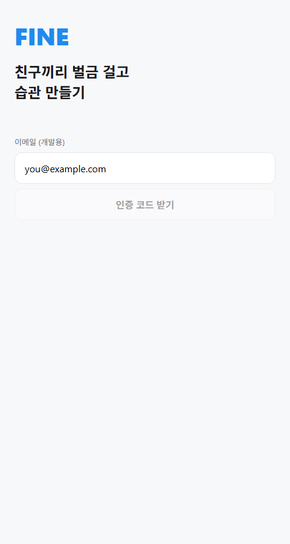
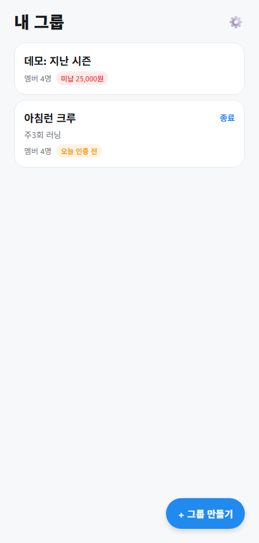
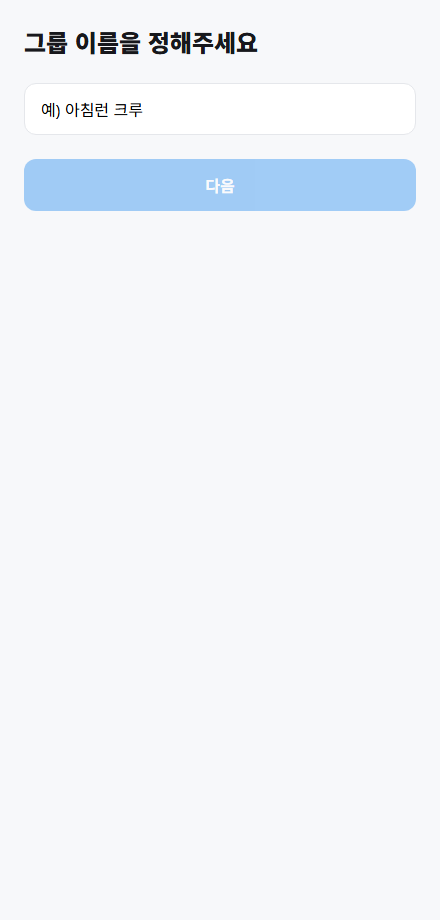

# FINE — 벌금형 소셜 습관 챌린지 앱

친한 소그룹(3~8명)이 벌금을 걸고 습관을 사진으로 인증하는 앱.
앱은 돈을 만지지 않고 **규칙 설정 · 인증 검증 · 주간 벌금 장부**만 제공한다(장부 모델).

- 단일 기술 명세: `FINE-TECH-SPEC` v1.2 기준 — 이 리포는 §14 구현 순서(T0~T13)를 따른다.
- 스택: Expo(React Native, expo-router, TypeScript strict) + Supabase(Postgres·Auth·Storage·Realtime·Edge Functions·pg_cron)


## 스크린샷

> 로컬 Supabase + 시드(가상 계정·그룹)로 웹 빌드를 띄워 캡처한 화면입니다.

| 로그인 | 내 그룹 | 그룹 만들기 |
|---|---|---|
|  |  |  |
## 시작하기 (로컬 개발)

```bash
npm install
# Docker Desktop 실행 후:
npx supabase start          # 로컬 Supabase (마이그레이션 자동 적용)
npm run seed                # 테스트 유저 4명 + 그룹 + active 시즌
npm start                   # Expo dev server
```

- 테스트 계정: `t1@fine.dev` ~ `t4@fine.dev` / 비번 `test1234` (이메일 OTP 코드는 Mailpit http://127.0.0.1:54324 에서 확인)
- **실기기 테스트 시** `.env`의 `EXPO_PUBLIC_SUPABASE_URL`을 `http://<PC LAN IP>:54321`로 변경.
- 카카오 로그인·푸시·카메라는 **dev build**(`expo-dev-client`) 필요. Expo Go에서는 이메일 OTP로 개발.

## 주요 스크립트

| 명령 | 설명 |
|---|---|
| `npm run typecheck` | `tsc --noEmit` |
| `npm run lint` | ESLint |
| `npm run db:reset` | 마이그레이션 재적용 (0001~0006) |
| `npm run seed` | 개발 시드 (유저·그룹·시즌) |
| `npm run gen-types` | DB → `src/types/db.ts` 타입 재생성 (말미 수동 별칭 블록 유지할 것) |
| `node --env-file=.env scripts/verify-rls.ts` | AC-2·AC-3 검증 (RLS 격리, 하루 1회 제한) |

서버 로직 테스트(AC-4·5·6, 정산 수식·멱등성·이의제기 재계산):

```bash
docker cp supabase/tests/settlement_test.sql supabase_db_fine:/tmp/t.sql
docker exec supabase_db_fine psql -U postgres -d postgres -v ON_ERROR_STOP=1 -f /tmp/t.sql
```

Edge Functions 로컬 실행·호출:

```bash
npx supabase functions serve
# 다른 터미널에서 (SERVICE_ROLE_KEY는 supabase start 출력값):
curl -X POST http://127.0.0.1:54321/functions/v1/settle-week -H "Authorization: Bearer <SERVICE_ROLE_KEY>"
```

## 검증된 수용 기준 (로컬 자동 테스트)

- AC-2 같은 날 2회 인증 서버 거부(23505) ✅
- AC-3 비멤버 RLS 격리(groups/seasons/checkins/ledger 0행, 인증 삽입 거부) ✅
- AC-4 `settle_due_weeks` 2회 실행 멱등 ✅
- AC-5 정산 수식 3케이스 (a)10,000 (b)0 (c)재계산 5,000 ✅
- AC-6 과반 무효 → rejected + 기정산 주 재계산 ✅
- AC-11 `build_daily_kpis` 멱등 + DQ 4종 통과 ✅
- 시즌 4주 전량 정산 후 `closed` 전이 ✅

실기기에서 확인 필요: 세션 유지·딥링크 콜드스타트(AC-9), 푸시 수신(AC-7), 카메라 인증 E2E(AC-1), 기기 시간 조작 불변(AC-10).

## 스펙과 달라진 점 / 남은 작업 (TODO(spec))

1. **`0006_grants.sql` 추가** — 최신 Supabase는 새 테이블에 API 롤(anon/authenticated/service_role) 기본 DML 권한을 주지 않아 명시 GRANT가 필요했다. 행 접근은 계속 RLS가 통제.
2. **벌금액 입력 UI** — §7.3의 "슬라이더"는 §2 허용 라이브러리에 슬라이더가 없어 프리셋 칩(3/5/10k/0/50k)으로 구현.
3. **T12 결제** — DB(0004)·rc-webhook·paywall 화면·플래그 격리는 완료. `react-native-purchases` 실제 연동(Offerings·구매·redeem)은 RevenueCat 키 발급 후 진행.
4. **카카오 로그인** — 플러그인·분기 준비 완료, `KAKAO_NATIVE_APP_KEY` 설정 + dev build에서 활성화.
5. **배포 시** `0003_cron.sql`의 `<PROJECT_REF>`, `<SERVICE_ROLE_KEY>` 치환 필요. EAS projectId 설정 후 푸시 토큰 발급 가능.
6. `src/types/db.ts`는 자동 생성 파일이라 250줄 제한(§0-4) 예외.

## 구조

```
app/                  # expo-router 화면 (§3, §7)
src/api/              # react-query 훅 — 화면은 여기만 호출
src/components/       # Button, Card, PhotoFeedItem, LedgerRow, ShareCard, ...
src/lib/              # supabase, analytics(이중 기록), notifications, errors, dates
src/i18n/ko.ts        # 사용자 노출 문자열 전부 (§17-10)
supabase/migrations/  # 0001 스키마·RLS·RPC → 0006 grants
supabase/functions/   # settle-week, remind-daily, resolve-disputes, rc-webhook
supabase/tests/       # 서버 로직 SQL 테스트
scripts/              # seed-users, verify-rls, gen-types
```
