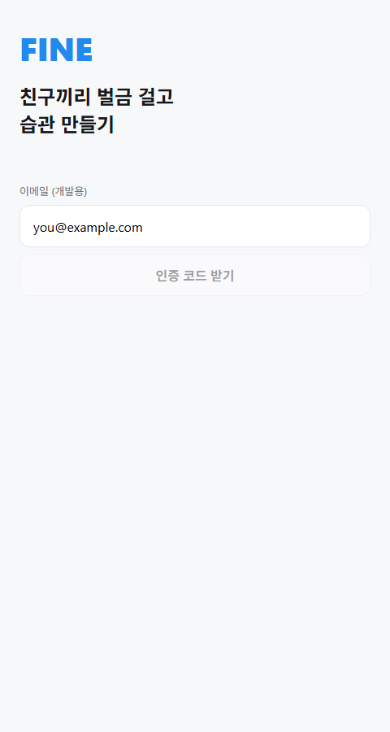
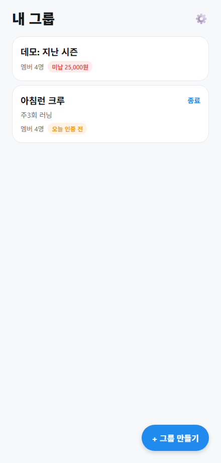
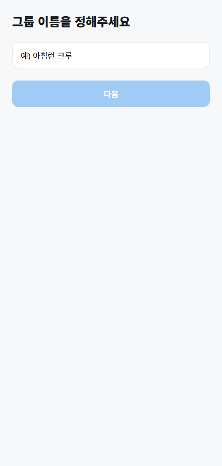

# FINE — 벌금형 소셜 습관 챌린지 앱

친한 소그룹(3~8명)이 벌금을 걸고 습관을 사진으로 인증하는 앱.
앱은 돈을 만지지 않고 **규칙 설정 · 인증 검증 · 주간 벌금 장부**만 제공한다(장부 모델).

- 단일 기술 명세: `TECH-SPEC` v1.2 기준 — 이 리포는 §14 구현 순서(T0~T13)를 따른다.
- 스택: Expo(React Native, expo-router, TypeScript strict) + Supabase(Postgres·Auth·Storage·Realtime·Edge Functions·pg_cron)
- 규모: RLS 정책 24건(RLS 활성 테이블 11) · SQL 함수 22개 · 화면 10개 · TS/TSX 약 4,800줄


## 스크린샷

> 로컬 Supabase + 시드(가상 계정·그룹)로 웹 빌드를 띄워 캡처한 화면입니다.

| 로그인 | 내 그룹 | 그룹 만들기 |
|---|---|---|
|  |  |  |
## 시작하기 (로컬 개발)

```bash
npm install
# Docker Desktop 실행 후:
npx supabase start          # 로컬 Supabase (마이그레이션 자동 적용)
npm run seed                # 테스트 유저 4명 + 그룹 + active 시즌
npm start                   # Expo dev server
```

- 테스트 계정: `t1@fine.dev` ~ `t4@fine.dev` / 비번 `test1234` (이메일 OTP 코드는 Mailpit http://127.0.0.1:54324 에서 확인)
- **실기기 테스트 시** `.env`의 `EXPO_PUBLIC_SUPABASE_URL`을 `http://<PC LAN IP>:54321`로 변경.
- 로그인: 이메일 OTP + Apple 로그인(구현, iOS 빌드 미검증). 카카오 로그인·푸시·카메라는 **dev build**(`expo-dev-client`) 필요. Expo Go에서는 이메일 OTP로 개발.

## 주요 스크립트

| 명령 | 설명 |
|---|---|
| `npm run typecheck` | `tsc --noEmit` |
| `npm run lint` | ESLint |
| `npm run db:reset` | 마이그레이션 재적용 (0001~0007) |
| `npm run seed` | 개발 시드 (유저·그룹·시즌) |
| `npm run gen-types` | DB → `src/types/db.ts` 타입 재생성 (말미 수동 별칭 블록 유지할 것) |
| `node --env-file=.env scripts/verify-rls.ts` | AC-2·AC-3 검증 (RLS 격리, 하루 1회 제한) |

서버 로직 테스트(AC-4·5·6, 정산 수식·멱등성·이의제기 재계산):

```bash
docker cp supabase/tests/settlement_test.sql supabase_db_fine:/tmp/t.sql
docker exec supabase_db_fine psql -U postgres -d postgres -v ON_ERROR_STOP=1 -f /tmp/t.sql
```

Edge Functions 로컬 실행·호출:

```bash
npx supabase functions serve
# 다른 터미널에서 (SERVICE_ROLE_KEY는 supabase start 출력값):
curl -X POST http://127.0.0.1:54321/functions/v1/settle-week -H "Authorization: Bearer <SERVICE_ROLE_KEY>"
```

## 검증된 수용 기준 (로컬 자동 테스트)

- AC-2 같은 날 2회 인증 서버 거부(23505) ✅
- AC-3 비멤버 RLS 격리(groups/seasons/checkins/ledger 0행, 인증 삽입 거부) ✅
- AC-4 `settle_due_weeks` 2회 실행 멱등 ✅
- AC-5 정산 수식 3케이스 (a)10,000 (b)0 (c)재계산 5,000 ✅
- AC-6 과반 무효 → rejected + 기정산 주 재계산 ✅
- AC-11 `build_daily_kpis` 멱등 + DQ 4종 통과 ✅
- 시즌 4주 전량 정산 후 `closed` 전이 ✅

실기기에서 확인 필요: 세션 유지·딥링크 콜드스타트(AC-9), 푸시 수신(AC-7), 카메라 인증 E2E(AC-1), 기기 시간 조작 불변(AC-10).

## 스펙과 달라진 점 / 남은 작업 (TODO(spec))

1. **`0006_grants.sql` 추가** — 최신 Supabase는 새 테이블에 API 롤(anon/authenticated/service_role) 기본 DML 권한을 주지 않아 명시 GRANT가 필요했다. 행 접근은 계속 RLS가 통제. 0006이 함수 EXECUTE까지 anon에 부여해 배치 함수가 열려 있었고(이전 리뷰 지적), `0007_revoke_fn_exec.sql`에서 회수했다. 클라이언트가 호출하는 RPC와 RLS 헬퍼만 authenticated에 재부여.
2. **벌금액 입력 UI** — §7.3의 "슬라이더"는 §2 허용 라이브러리에 슬라이더가 없어 프리셋 칩(3/5/10k/0/50k)으로 구현.
3. **T12 결제** — DB(0004)·rc-webhook·paywall 화면·플래그 격리는 완료. `react-native-purchases` 실제 연동(Offerings·구매·redeem)은 RevenueCat 키 발급 후 진행.
4. **카카오 로그인** — 플러그인·분기 준비 완료, `KAKAO_NATIVE_APP_KEY` 설정 + dev build에서 활성화.
5. **배포 시** `0003_cron.sql`의 `<PROJECT_REF>`, `<SERVICE_ROLE_KEY>` 치환 필요. EAS projectId 설정 후 푸시 토큰 발급 가능.
6. `src/types/db.ts`는 자동 생성 파일이라 250줄 제한(§0-4) 예외.
7. **인증 업로드 롤백** — insert 실패 시 파일 삭제를 시도하나 Storage delete 정책이 없어 고아 파일이 남는다(파기 배치에서 정리 예정).

## 알려진 한계

각 항목은 무엇 / 왜 / 다음 순서.

1. **profiles 민감 컬럼 노출** (`0001_init.sql:453` profiles_select) — 같은 그룹 멤버가 profiles 전체 행(push_token·is_adult 포함)을 읽을 수 있다 / 닉네임·아바타 표시용 정책을 행 단위로만 제한했다 / push_token을 본인만 읽는 별도 테이블 또는 공개 컬럼 view로 분리.
2. **seasons paid 제한 없음** (`0001_init.sql:480` seasons_insert, `:483` seasons_update_draft) — 그룹장이 draft 시즌의 paid를 직접 true로 쓸 수 있어 페이월 우회가 가능하다 / 정책이 status='draft'만 검사한다 / with check에 paid = false 추가, paid 변경은 `redeem_season_pass`(0004)로만.
3. **photo_path 미검증** (`0001_init.sql:184-202` checkin_before_insert) — 같은 시즌 다른 멤버의 사진 경로로 인증 행을 만들 수 있다 / 트리거가 user_id·날짜·주차만 재계산하고 경로는 검사하지 않는다 / 트리거에서 `{season_id}/{auth.uid()}/` 접두사 검증.
4. **이의제기–정산 경합** (`0001_init.sql:326` settle_due_weeks, `:375` resolve_open_disputes, `0003_cron.sql:6-22`) — 미해결 이의제기가 있는 주도 정산되고, valid 판정 분기는 장부를 재계산하지 않는다 / 두 배치가 독립 스케줄(매시 :05, 00:10)로 돌고 정합성 검사가 없다 / 미해결 dispute가 있는 주는 정산 보류 또는 valid 분기에도 재계산, `settlement_test.sql`에 케이스 추가.
5. **pg_cron 키 평문** (`0003_cron.sql:6-22`) — service_role 키가 cron.job 테이블에 평문으로 저장되는 설계다 / 플레이스홀더를 배포 시 손으로 치환하는 방식이다 / Vault(`vault.decrypted_secrets`)에서 읽거나 DB 함수를 cron.schedule로 직접 호출(0005의 `build-kpis` 방식).
6. **Edge Function 인증 endsWith** (`supabase/functions/_shared/push.ts:22-27`) — Authorization 헤더를 service_role 키와 endsWith로 비교한다 / 'Bearer ' 접두사 처리를 단순화했다 / 접두사를 떼고 정확 비교로 교체.
7. **딥링크 경로 불일치** (`supabase/functions/settle-week/index.ts:31`, `src/lib/notifications.ts:63-66`) — 정산 푸시의 `fine:///group/season/{season_id}/ledger`가 실제 라우트 `app/(app)/group/[id]/ledger.tsx`(그룹 id 기준)와 다르다 / TECH-SPEC §6.1의 URL을 그대로 구현했다 / seasons.group_id를 조인해 `fine:///group/{group_id}/ledger`로 발송.
8. **track_event 무제한** (`0005_analytics.sql:20`) — 로그인 사용자가 임의 이름·props의 이벤트를 횟수 제한 없이 넣을 수 있다 / 수집 진입점에 이름 목록 검사·빈도 제한이 없다 / event_name을 §12 목록으로 제한하고 사용자별 상한 추가.
9. **SQL 테스트 1파일·CI 없음** (`supabase/tests/settlement_test.sql`, `scripts/verify-rls.ts`, `.github/` 없음) — 자동 테스트는 정산 SQL 1파일과 RLS 스크립트뿐이고 모두 로컬 Docker 수동 실행이다 / MVP 범위에서 CI 구성을 보류했다 / GitHub Actions에서 supabase start → SQL 테스트 → RLS 스크립트 → typecheck/lint.

완료: 함수 EXECUTE 일괄 부여(0006) — 0007에서 회수. 로컬 Supabase(Docker)에서 `db reset` 후 anon 키 `get_remind_targets` RPC 42501, `settlement_test.sql` 통과 확인(2026-10-08).

## 구조

```
app/                  # expo-router 화면 (§3, §7)
src/api/              # react-query 훅 — 화면은 여기만 호출
src/components/       # Button, Card, PhotoFeedItem, LedgerRow, ShareCard, ...
src/lib/              # supabase, analytics(이중 기록), notifications, errors, dates
src/i18n/ko.ts        # 사용자 노출 문자열 전부 (§17-10)
supabase/migrations/  # 0001 스키마·RLS·RPC → 0006 grants → 0007 함수 EXECUTE 회수
supabase/functions/   # settle-week, remind-daily, resolve-disputes, rc-webhook
supabase/tests/       # 서버 로직 SQL 테스트
scripts/              # seed-users, verify-rls, gen-types
```
